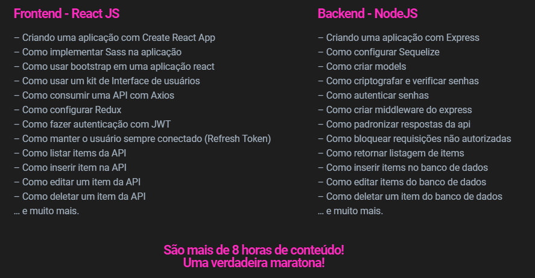
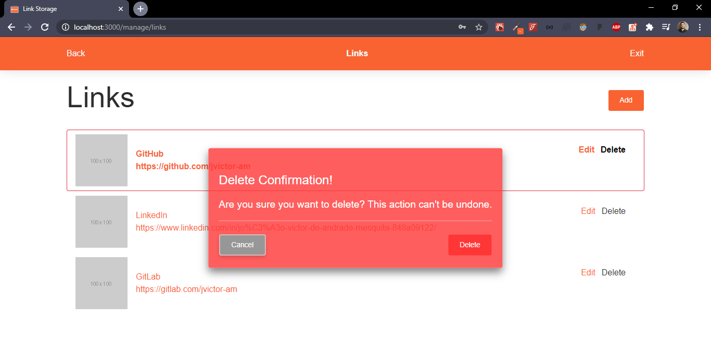
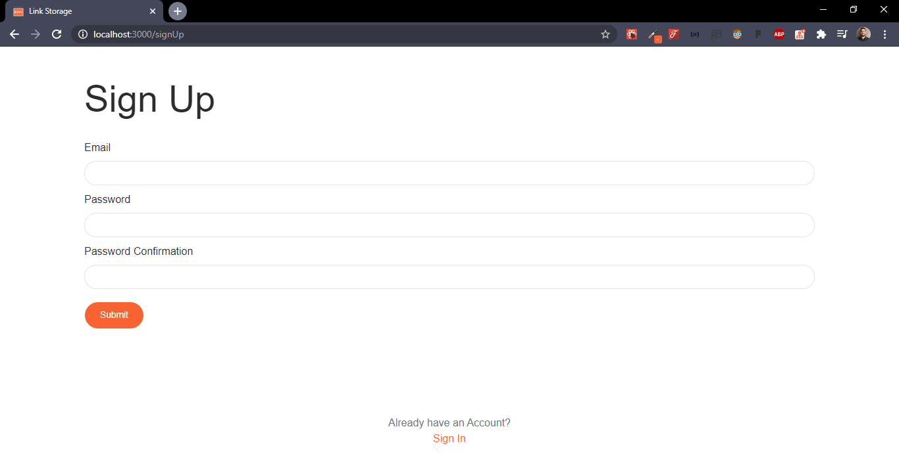
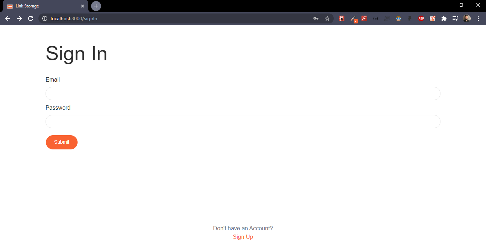
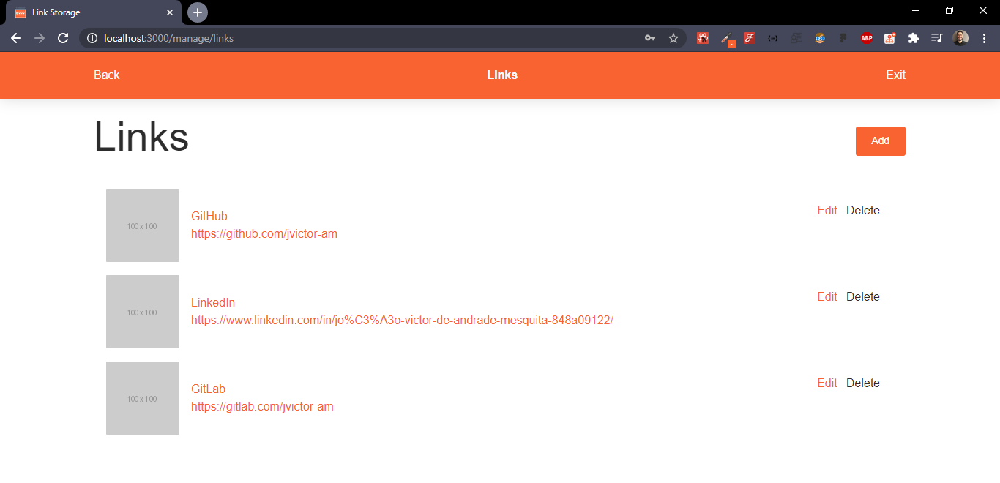
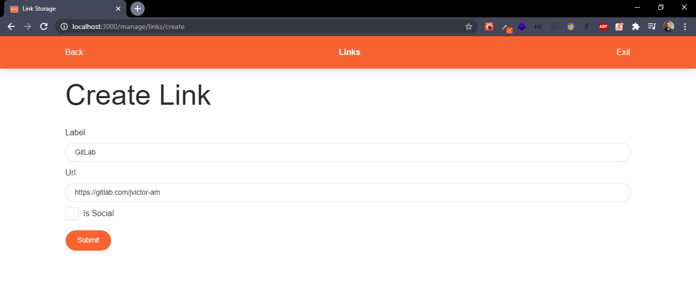
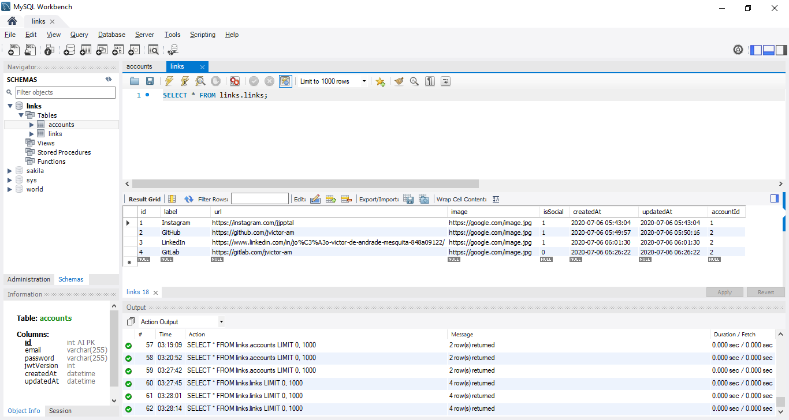

<h1 align="center">
  
</h1>

<h2 align="center">
  Link Storage
</h2>

## :computer: About

Application (FrontEnd) developed over training by Senior Software Engineering [Emerson Broga](https://emersonbroga.com/) using ReactJS as main technology and much more.
The goal is to be able to have an account where you can store as many Social and Professional Links as you want. But we can say that the main focus is
to learn and practice the framework, language, libs, etc. You can find the BackEnd of this application [here](https://github.com/jvictor-am/Link-Storage-API). <br />
There is a pretty good state management using Redux (Actions and Reducers), which makes the project even more interesting than it looks.
Thanks for the opportunity and teaching, Broga.

## Built with:

- React (^16.13.1)
- Node (v12.16.1)
- NPM (6.13.4)
- Bootstrap: (^4.5.0)
- Redux: (^4.0.5)
- Sass: (^4.14.1)
- Universal-cookie: (^4.0.3)

## :framed_picture: :computer: Web Application Screens

<h3 align="center">
  


<details><summary><b>More Web Screens</b></summary>
  






</details>
</h3>

## How to install and run on your computer:

<strong>1. Clone this project and install dependencies</strong>

```
$ git clone https://github.com/jvictor-am/Link-Storage-FrontEnd.git
$ cd Link-Storage-FrontEnd
$ npm install
```

<strong>2. Run on localhost:3000</strong>

```
$ npm start
```

</br>

---

# Author

[**João Victor**](https://www.linkedin.com/in/jo%C3%A3o-victor-de-andrade-mesquita-848a09122/)

<h2 align="center">
  Thank You!
</h2>
